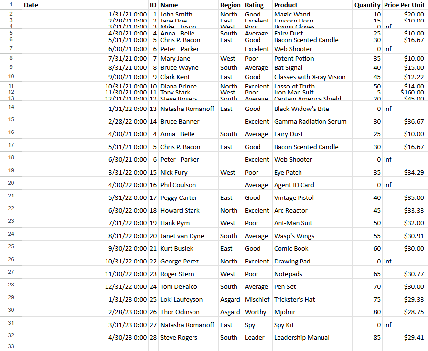
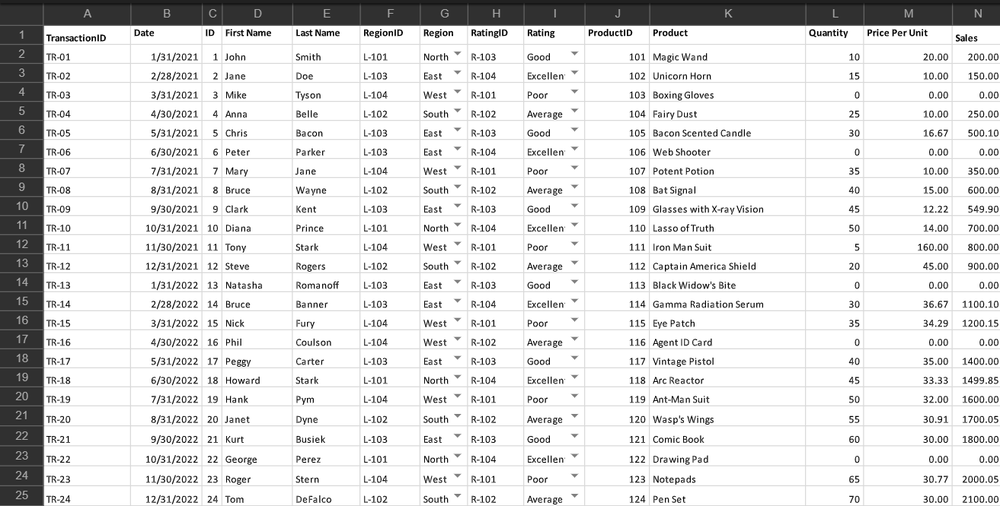
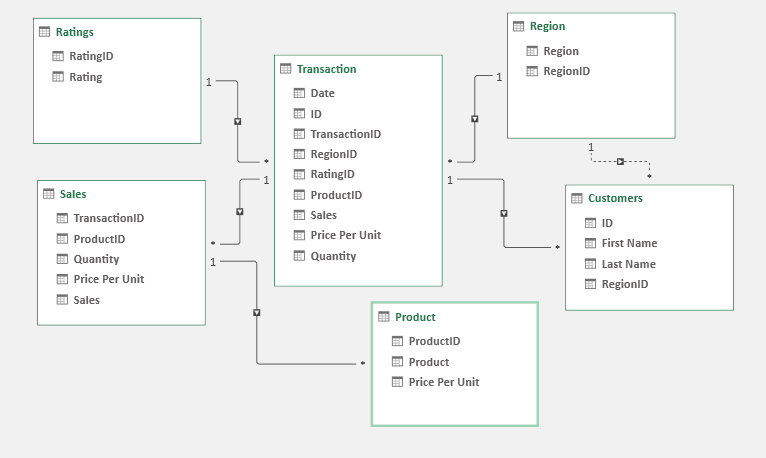

# Midterm Task 1
For this task we are given a Flat data from Excel (See rawfile) and we are Task to perform Data CLeaning and Preparation

## STEP 1 Data Cleaning process
Load the raw file

Fit Column and row width and height

TRIM extra spaces

Remove NULL values

Remove Duplicates

## STEP 2 Normalization

Performed 1NF

Perform Table split using 2NF

Perform 3 NF

Mapped the Normalized tables as a Physical Data Model

Raw cleaned Data

# Screenshots of Output

## Raw Data

## Cleaned Data

## Entity Relationship Diagram

